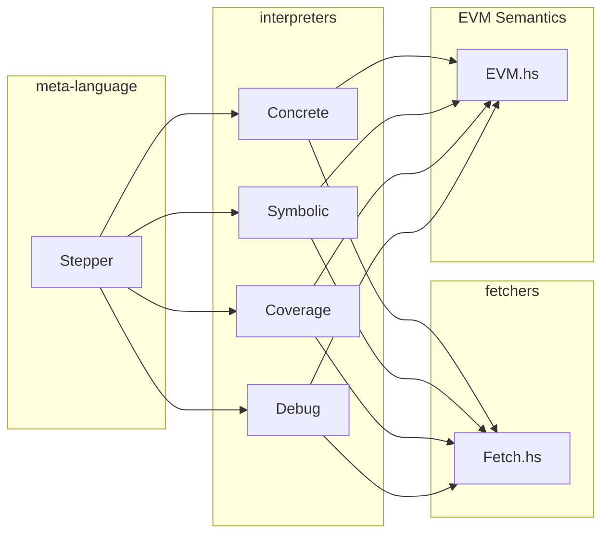

# Build System

All tools in this directory are built with `nix`, a declarative package manager
which gives a secure and predictable bundling of dependencies.

`[flake.nix](./flake.nix)` contains all nix related build system infra.

# Steppers & Interpreters

The core evm semnatics in hevm can be found in `EVM.hs`. EVM state is contained in the `VM` record,
and the `exec1` function executes a single opcode inside the monad `type EVM a = State VM a`.

The core semantics are pure, and should information from the outside world be required to continue
execution (rpc queries, smt queires, user input), execution will halt, and the `result` field of the
VM will be an instance of `VMFailure (Query _)`.

Multiple steps of EVM execution are orchestrated via interpreters for a meta language. Programs in
the meta language are called Steppers. The instructions in the meta language can be found in
`Stepper.hs`.

There are many different interpreters with different
features, e.g. a concrete interpreter, a symbolic interpreter, an interpreter that collects coverage
information, a debug interpreter that can accept user input. Interpreters can handle Queries in
different ways, for example in the symbolic inerpreter, both sides of a branch point will be
explored, while in the symbolic debug interpreter, user input will be requested to determine which
side of the branch point will be taken.

Interpreters are parameterized by a `Fetcher` that can handle rpc and smt queries, and can be
instantiated with fetchers that could have different fetching strategies (e.g. caching).

Interpreters execute Steppers and use their Fetcher to handle any Queries that need to be resolved.

This architecure is very modular and pluggable, and allows the core semantics to be shared between
different interpreters, as well as the reuse of steppers between different interpreters, making it
easy to e.g. replay a failed test in the debug interpreter, or to share the same test execution
strategy between concrete and symbolic interpreters.



# Expr

The symbolic execution features in hevm are built using a custom IR (imaginatively named `Expr`). This is a summarized trace semantics of a given EVM program.

One important principle is that of local context: e.g. each term representing a read from a Buf / Storage will always contain a snapshot of the state of the buffer / store at the time the read occured. This ensures that all context relevant to a given operation is contained within the term that represents that operation, and allows subsequent analysis to be stateless.

Expressions in this language can have the following types:

- `End`: control flow
- `Word`: a 256 bit word (a stack item)
- `Byte`: a single byte
- `Buf`: a byte array (used for calldata, memory and returndata)
- `Storage`: contract storage
- `Logs`: EVM logs

*Control Flow*

An EVM program is represented by an `Expr End`, which is either a single end state for a program without branches, or a series of nested if-then-else terms, where each leaf is an end state. Some end states (e.g. `Return`) contain copies of any externally observable data (i.e. returndata and post call storage).

As an example the following Expr encodes a program that branches based on the equality of two symbolic words ("a" and "b"), and returns if they are equal and reverts if they are not:

```haskell
(ITE (Eq (Var "a") (Var "b"))
  (Return EmptyBuf EmptyStore)
  (Revert EmptyBuf))
```

*Buffers*

Memory, calldata, and returndata are all represented as a Buf. Semantically speaking a Buf is a byte array with of size 2^256.

Bufs have three base constructors:
  - EmptyBuf:       all elements are zero
  - AbstractBuf:    all elements are fully abstract values
  - ConcreteBuf bs: all elements past (length bs) are zero

Bufs can be read from with:
  - ReadByte idx buf: read the byte at idx from buf
  - ReadWord idx buf: read the byte at idx from buf

Bufs can be written to with:
  - WriteByte idx val buf: write val to idx in buf
  - WriteWord idx val buf: write val to idx in buf
  - CopySlice srcOffset dstOffset size src dst:
      overwrite dstOffset -> dstOffset + size in dst with srcOffset -> srcOffset + size from src

e.g. the following Buf expression represents an abi encoded call to `foo(uint256 a)`:

```haskell
(WriteWord (Lit 0x4) (Var "a")
(WriteByte (Lit 0x3) (LitByte 56)
(WriteByte (Lit 0x2) (LitByte 189)
(WriteByte (Lit 0x1) (LitByte 190)
(WriteByte (Lit 0x0) (LitByte 47)
(AbstractBuf "txdata")))))
```

This represents calldata of the form:

```
-----------------------------------------------------------------------
| <function selector> | <symbolic word> | arbitrary symbolic data.... |
-----------------------------------------------------------------------
```

Note that a Buf expression contains a copy of all historical writes, meaning that it is possible to write multiple times to the same location. In this case only the topmost write is relevant. This allows us to mix symbolic and concrete writes to the same buffer.

*Storage*

Storage expressions are similar, but instead of writing regions of bytes, we write a word to a particular key in a given addresses storage. Note that as with a Buf, writes can be sequenced on top of concrete, empty and fully abstract starting states.

As with Bufs, Storage expressions contain a full history of all previous writes.

e.g. the following expression represents a write of a symbolic word "c" to slot 2 for the zero address followed by a write of 1 to the slot at the symbolic location "b" for the zero address. These writes are sequenced on top of an `EmptyStore` meaning all other storage locations are held to be 0.

```haskell
(SStore (Lit 0) (Var "b") (Lit 1)
(SStore (Lit 0) (Lit 2) (Var "c")
EmptyStore))
```

*Logs*

Logs are also represented as a sequence of writes, but unlike Buf and Storage expressions, Log writes are always sequenced on an empty starting point, and overwriting is not allowed.

# Symbolic Execution

During symbolic execution all possible branches of the program are explored symbolically. Reachability analysis is performed at this stage only if needed for loop unrolling. This produces an Expr End. As an example consider the following program:

```solidity
contract C {
    uint x;
    function set(uint v) public {
        x = v + v;
    }
}
```

This decompiles into the following Expr End:

```haskell
(ITE (IsZero (CallValue 0))
  (ITE (LT (BufLength (AbstractBuf "txdata")) (Lit 0x4))
    (Revert ConcreteBuf "")
    (ITE (Eq (Lit 0x60fe47b1) (SHR (Lit 0xe0) (ReadWord (Lit 0x0) (AbstractBuf "txdata"))))
      (ITE (IsZero (SLT (Sub (BufLength (AbstractBuf "txdata")) (Lit 0x4)) (Lit 0x20)))
        (ITE (IsZero (GT (ReadWord (Lit 0x4) (AbstractBuf "txdata")) (Sub (Lit 0xffffffffffffffffffffffffffffffffffffffffffffffffffffffffffffffff) (ReadWord (Lit 0x4) (AbstractBuf "txdata")))))
          (Return
            Data: EmptyBuf
            Store: SStore (Lit 0xffffffffffffffff) (Lit 0x0) (Add (ReadWord (Lit 0x4) (AbstractBuf "txdata")) (ReadWord (Lit 0x4) (AbstractBuf "txdata"))) AbstractStore
          )
          (Revert ConcreteBuf "NH{q\NUL\NUL\NUL\NUL\NUL\NUL\NUL\NUL\NUL\NUL\NUL\NUL\NUL\NUL\NUL\NUL\NUL\NUL\NUL\NUL\NUL\NUL\NUL\NUL\NUL\NUL\NUL\NUL\NUL\NUL\NUL\DC1")
        )
        (Revert ConcreteBuf "")
      )
      (Revert ConcreteBuf "")
    )
  )
  (Revert ConcreteBuf "")
)
```
